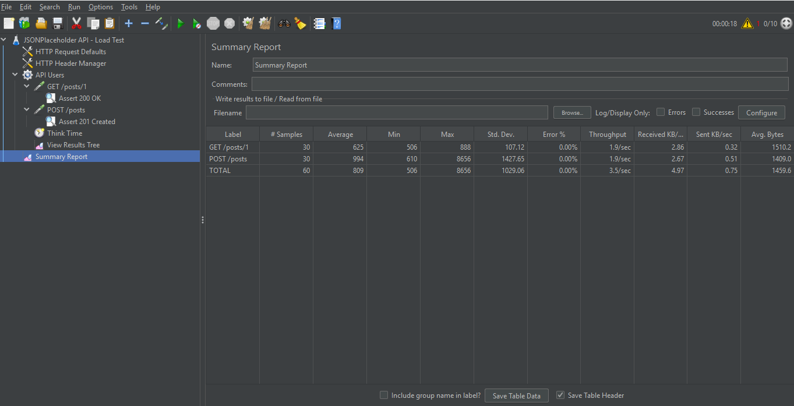
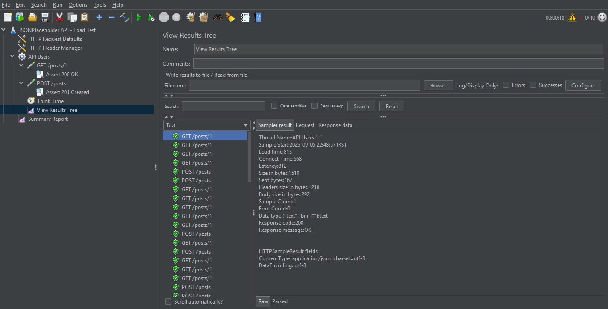

# JSONPlaceholder API – Performance Test (Apache JMeter)

A small **practice project** for getting familiar with Apache JMeter. It runs a
simple load test against the public [JSONPlaceholder](https://jsonplaceholder.typicode.com)
REST API and checks that each request returns the expected status code.

> Scope: this is a learning exercise, not a full performance-engineering suite.

## What it does

| Step | Request        | Check                     |
|------|----------------|---------------------------|
| 1    | `GET /posts/1` | HTTP status is `200`      |
| 2    | `POST /posts`  | HTTP status is `201`      |

**Load:** 10 virtual users, ramped up over 5 seconds, each running the two
requests 3 times, with a random think time (0.5–1.5 s) between iterations.

## Test plan structure

```
Test Plan
├── HTTP Request Defaults     (host + protocol)
├── HTTP Header Manager       (Content-Type: application/json)
└── Thread Group "API Users"  (10 users · ramp-up 5s · 3 loops)
    ├── GET /posts/1
    │   └── Response Assertion – 200
    ├── POST /posts
    │   └── Response Assertion – 201
    ├── Think Time (Uniform Random Timer)
    ├── View Results Tree      (for debugging – disable for real load runs)
    └── Summary Report
```

## How to run

**GUI (for editing / debugging):**

```
jmeter -t api-load-test.jmx
```

The *View Results Tree* listener lets you inspect individual requests and
responses. Disable it before a real load run – it is memory-heavy.

**Headless (the right way to run a load test):**

```
jmeter -n -t api-load-test.jmx -l results/results.jtl -e -o results/report
```

Then open `results/report/index.html` for the HTML dashboard.

## Sample results

Configuration: 10 users · ramp-up 5 s · 3 loops → **60 requests**, **0% errors**.

| Label        | Samples | Avg (ms) | Min | Max  | Error % | Throughput (/s) |
|--------------|---------|----------|-----|------|---------|-----------------|
| GET /posts/1 | 30      | 625      | 506 | 888  | 0.00%   | 1.94            |
| POST /posts  | 30      | 994      | 610 | 8656 | 0.00%   | 1.94            |
| **TOTAL**    | 60      | 809      | 506 | 8656 | 0.00%   | 3.49            |

All status-code assertions passed. The `POST /posts` max (8.6 s) comes from a
few slow outliers on the public mock API, not a steady-state issue.

### Summary Report



### View Results Tree



More detail and the raw CSV export: [docs/RESULTS.md](docs/RESULTS.md).

## Requirements

- Apache JMeter 5.6.3+
- Java 8+ (Java 17 recommended)

## Notes

- JSONPlaceholder is a mock API – `POST /posts` returns `201` but does not
  actually store anything.
- `results/` (raw `.jtl` / HTML dashboard) is git-ignored; only the curated
  summary and screenshots under `docs/` are committed.
- Numbers reflect a public API over the internet, not a controlled test
  environment.
